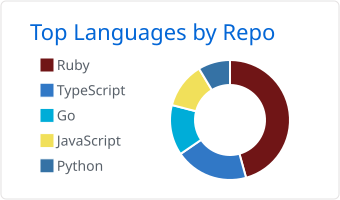
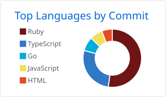

# Aotokitsuruya

I am a programming skill missionary, seeker. 
My favorite language is Ruby.

## Insight

* [弦而時習之](https://blog.aotoki.me) - Deep into the programming skills.
* [軟體工程師的日常心法](https://vocus.cc/as-a-developer/home) - The common knowledge of software developers.
* [蒼時寫程式](https://www.youtube.com/channel/UCcABbJfCL0DfNh3wDk_-7lg) - The coding videos.

## Consulting

Please contact me with `consultant[at]aotoki.me` for more details.

> Available in Taipei, Taiwan.

## Writing

<!-- BLOG-POST-LIST:START -->
- [What Disappeared After AI Started Writing Our Code?](https://blog.aotoki.me/en/posts/2026/10/07/what-disappeared-when-ai-writes-code/) · [中文](https://blog.aotoki.me/posts/2026/10/07/what-disappeared-when-ai-writes-code/) · 2026-10-07
- [Tsuzuri: Building Another Subtitle Editor in the AI Era — Is It Reinventing the Wheel?](https://blog.aotoki.me/en/posts/2026/09/30/tsuzuri-reinventing-subtitle-editor/) · [中文](https://blog.aotoki.me/posts/2026/09/30/tsuzuri-reinventing-subtitle-editor/) · 2026-09-30
- [Kobako: Script Execution](https://blog.aotoki.me/en/posts/2026/09/23/kobako-script-execution/) · [中文](https://blog.aotoki.me/posts/2026/09/23/kobako-script-execution/) · 2026-09-23
- [Kobako: Standard Output](https://blog.aotoki.me/en/posts/2026/09/16/kobako-standard-output/) · [中文](https://blog.aotoki.me/posts/2026/09/16/kobako-standard-output/) · 2026-09-16
- [Kobako: Resource Limits](https://blog.aotoki.me/en/posts/2026/09/09/kobako-resource-limits/) · [中文](https://blog.aotoki.me/posts/2026/09/09/kobako-resource-limits/) · 2026-09-09<!-- BLOG-POST-LIST:END -->

## Activity

