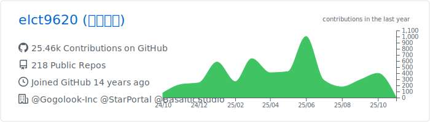
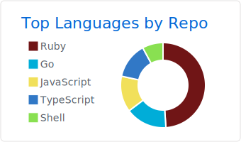
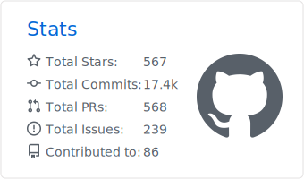

# Aotokitsuruya

I am a programming skill missionary, seeker. 
My favorite language is Ruby.

## Insight

* [弦而時習之](https://blog.aotoki.me) - Deep into the programming skills.
* [軟體工程師的日常心法](https://vocus.cc/as-a-developer/home) - The common knowledge of software developers.
* [蒼時寫程式](https://www.youtube.com/channel/UCcABbJfCL0DfNh3wDk_-7lg) - The coding videos.

## Consulting

Please contact me with `consultant[at]aotoki.me` for more details.

> Available in Taipei, Taiwan.

## Activity

